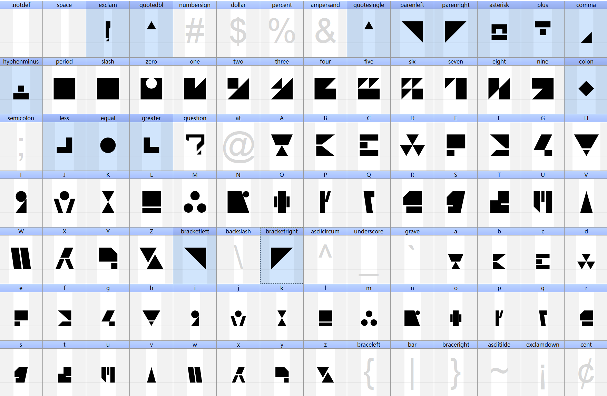

## Endfield_Font

English readme: [README_en](./README_en.md)

### 说明

EndfieldByButan.ttf 是基于鹰角网络在游戏《明日方舟》和《明日方舟：终末地》及其宣传材料中出现的原创文字，经过推导破译后整理得到的字体设计。该字体可以视为明日方舟这一IP的二创产物。

注意，为了让该字体可以基本使用，本人额外添加了以下所有标蓝的字符。这些字符和明日方舟可能的设定无关。

该字体依照CC BY-NC 4.0 协议发布： https://creativecommons.org/licenses/by-nc/4.0/

您可以随意使用/二创，但不得商用。

鹰角网络理应拥有该文字设计的最终解释权。

如有任何疑问或建议，可以B站私信@罗醭坦
